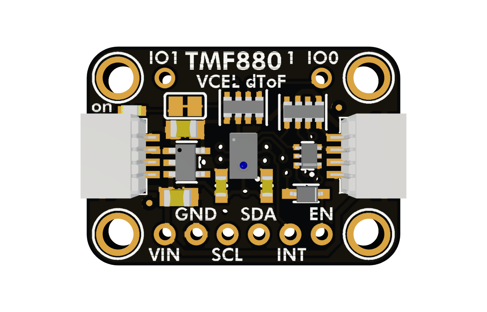

# Adafruit TMF8801 

Arduino library for the ams OSRAM TMF8801 direct time-of-flight distance
sensor.

This library uses the Arduino I2C interface and
[Adafruit BusIO](https://github.com/adafruit/Adafruit_BusIO). It supports
continuous and single-shot ranging, result interrupts, factory calibration,
algorithm-state replay, GPIO configuration, and standby mode.

The driver uploads version 3.0.22.0 of the sensor's measurement firmware during
`begin()`. The image comes from the official
[ams OSRAM TMF8801 software package](https://ams-osram.com/products/sensor-solutions/direct-time-of-flight-sensors-dtof/ams-tmf8801-1d-time-of-flight-sensor).
The firmware is provided for use with ams OSRAM TMF8801 devices and is not
covered by this library's MIT license.

Adafruit invests time and resources providing this open source code. Please
support Adafruit and open-source hardware by purchasing products from
[Adafruit](https://www.adafruit.com/).

This library is released under the MIT license. See `LICENSE` for details.
